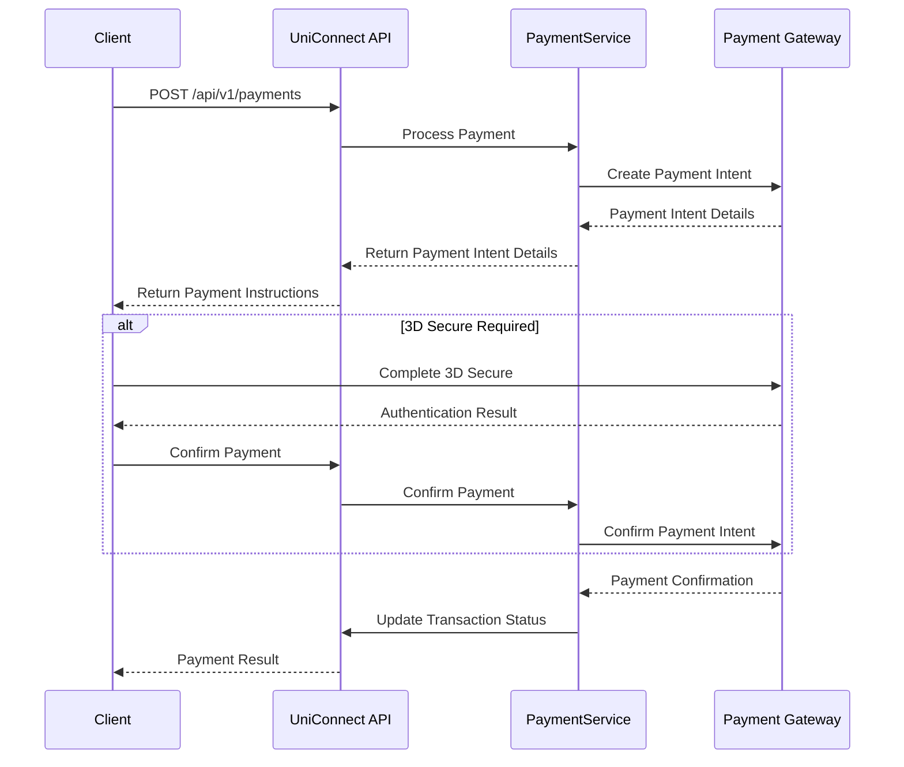
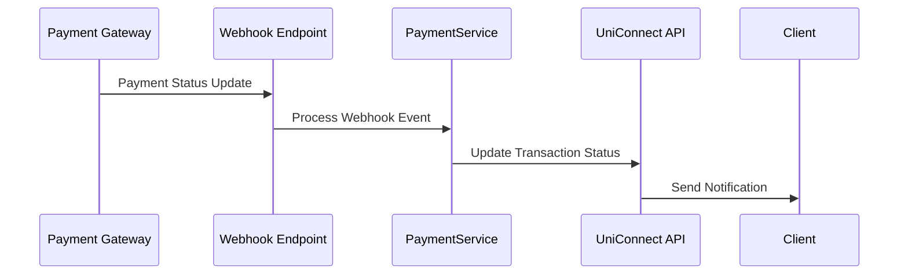
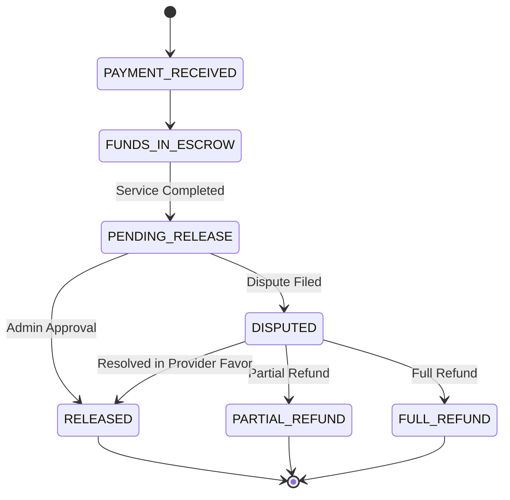

# Financial Module Technical Specification

## 1. Introduction

This document provides detailed technical specifications for the financial management module of the UniConnect platform. It translates the business requirements and use cases into technical implementation guidelines for the development team.

## 2. Module Architecture

### 2.1 Component Overview

The financial module consists of the following key components:

```
FinancialModule
├── PaymentProcessingService
│   ├── PaymentGatewayIntegration
│   ├── EscrowManagement
│   ├── TransactionProcessing
│   └── RefundProcessing
├── BillingService
│   ├── InvoiceGeneration
│   ├── ReceiptGeneration
│   └── TaxCalculation
├── FinancialReportingService
│   ├── ProviderEarningsReporting
│   ├── PlatformRevenueReporting
│   └── TransactionReporting
├── PayoutService
│   ├── ProviderPayoutProcessing
│   ├── PaymentMethodManagement
│   └── PayoutScheduling
└── DisputeManagementService
    ├── DisputeResolution
    ├── RefundCalculation
    └── MediationProcessing
```

### 2.2 Interaction with Other Modules

The Financial Module interacts with the following modules:

1. **User Management Module**: For user authentication and authorization
2. **Service Request Module**: For service status tracking and payment triggers
3. **Notification Module**: For payment notifications and alerts
4. **Document Management Module**: For invoices, receipts, and financial documents
5. **Admin Module**: For payment approvals and dispute resolution

## 3. Data Models

### 3.1 Core Financial Entities

#### 3.1.1 Transaction

```json
{
  "id": "UUID",
  "transactionType": "PAYMENT|REFUND|PAYOUT|FEE",
  "amount": "Decimal",
  "currency": {
    "id": "UUID",
    "code": "String", // ISO 4217 currency code
    "symbol": "String"
  },
  "status": "PENDING|PROCESSING|COMPLETED|FAILED|CANCELLED",
  "serviceRequestId": "UUID", // Reference to service request
  "studentId": "UUID", // Reference to student
  "providerId": "UUID", // Reference to provider
  "paymentMethodId": "UUID", // Reference to payment method
  "paymentGatewayTransactionId": "String", // External reference
  "platformFeeAmount": "Decimal",
  "providerAmount": "Decimal",
  "escrowStatus": "NOT_IN_ESCROW|IN_ESCROW|RELEASED|REFUNDED",
  "escrowReleaseDate": "DateTime",
  "metadata": "JSON", // Additional payment gateway data
  "notes": "String",
  "createdAt": "DateTime",
  "updatedAt": "DateTime"
}
```

#### 3.1.2 PaymentMethod

```json
{
  "id": "UUID",
  "userId": "UUID",
  "type": "CREDIT_CARD|BANK_ACCOUNT|PAYPAL|CRYPTOCURRENCY|CASH|EXCHANGE_TRANSFER",
  "isDefault": "Boolean",
  "status": "ACTIVE|INACTIVE|PENDING_VERIFICATION",
  "details": {
    // For credit card
    "cardType": "String",
    "lastFourDigits": "String",
    "expiryMonth": "Integer",
    "expiryYear": "Integer",
    "cardHolderName": "String",

    // For bank account
    "accountNumber": "String (encrypted)",
    "routingNumber": "String (encrypted)",
    "bankName": "String",
    "accountHolderName": "String",

    // For PayPal
    "email": "String",

    // For cryptocurrency
    "walletAddress": "String",
    "cryptoType": "String"
  },
  "gatewayTokens": {
    "stripeCustomerId": "String",
    "stripePaymentMethodId": "String",
    "paypalTokenId": "String"
  },
  "billingAddress": {
    "addressLine1": "String",
    "addressLine2": "String",
    "city": "String",
    "state": "String",
    "postalCode": "String",
    "country": "String"
  },
  "createdAt": "DateTime",
  "updatedAt": "DateTime"
}
```

#### 3.1.3 Escrow

```json
{
  "id": "UUID",
  "transactionId": "UUID",
  "amount": "Decimal",
  "currency": "String",
  "status": "FUNDED|PENDING_RELEASE|RELEASED|REFUNDED|DISPUTED",
  "fundingDate": "DateTime",
  "scheduledReleaseDate": "DateTime",
  "actualReleaseDate": "DateTime",
  "releasedById": "UUID", // Admin who approved release
  "releaseNotes": "String",
  "createdAt": "DateTime",
  "updatedAt": "DateTime"
}
```

#### 3.1.4 Invoice

```json
{
  "id": "UUID",
  "invoiceNumber": "String",
  "serviceRequestId": "UUID",
  "studentId": "UUID",
  "providerId": "UUID",
  "issueDate": "DateTime",
  "dueDate": "DateTime",
  "status": "DRAFT|ISSUED|PAID|PARTIALLY_PAID|CANCELLED|OVERDUE",
  "subtotal": "Decimal",
  "taxAmount": "Decimal",
  "discountAmount": "Decimal",
  "totalAmount": "Decimal",
  "paidAmount": "Decimal",
  "currency": "String",
  "items": [
    {
      "description": "String",
      "quantity": "Integer",
      "unitPrice": "Decimal",
      "subtotal": "Decimal",
      "taxRate": "Decimal",
      "taxAmount": "Decimal",
      "total": "Decimal"
    }
  ],
  "notes": "String",
  "termsAndConditions": "String",
  "documentUrl": "String", // PDF invoice
  "createdAt": "DateTime",
  "updatedAt": "DateTime"
}
```

#### 3.1.5 Dispute

```json
{
  "id": "UUID",
  "transactionId": "UUID",
  "serviceRequestId": "UUID",
  "initiatorId": "UUID",
  "initiatorType": "STUDENT|PROVIDER",
  "respondentId": "UUID",
  "respondentType": "STUDENT|PROVIDER",
  "status": "OPENED|UNDER_REVIEW|WAITING_FOR_INFO|RESOLVED|CLOSED",
  "category": "SERVICE_QUALITY|DELIVERY_ISSUE|PAYMENT_ISSUE|OTHER",
  "description": "String",
  "evidence": [
    {
      "documentId": "UUID",
      "description": "String",
      "uploadedBy": "UUID",
      "uploadedAt": "DateTime"
    }
  ],
  "resolution": {
    "type": "FULL_REFUND|PARTIAL_REFUND|NO_REFUND|REPLACEMENT_SERVICE",
    "refundAmount": "Decimal",
    "refundTransactionId": "UUID",
    "notes": "String",
    "resolvedById": "UUID",
    "resolvedAt": "DateTime"
  },
  "createdAt": "DateTime",
  "updatedAt": "DateTime"
}
```

### 3.2 Database Schema

```sql
-- Transactions Table
CREATE TABLE transactions (
    id UUID PRIMARY KEY,
    transaction_type VARCHAR(20) NOT NULL,
    amount DECIMAL(16,2) NOT NULL,
    currency_id UUID NOT NULL REFERENCES currencies(id),
    status VARCHAR(20) NOT NULL,
    service_request_id UUID REFERENCES service_requests(id),
    student_id UUID REFERENCES users(id),
    provider_id UUID REFERENCES users(id),
    payment_method_id UUID REFERENCES payment_methods(id),
    payment_gateway_transaction_id VARCHAR(100),
    platform_fee_amount DECIMAL(16,2) NOT NULL,
    provider_amount DECIMAL(16,2) NOT NULL,
    escrow_status VARCHAR(20),
    escrow_release_date TIMESTAMP,
    metadata JSONB,
    notes TEXT,
    created_at TIMESTAMP NOT NULL DEFAULT CURRENT_TIMESTAMP,
    updated_at TIMESTAMP,
    created_by UUID REFERENCES users(id),
    updated_by UUID REFERENCES users(id),
    is_deleted BOOLEAN DEFAULT false
);

-- Payment Methods Table
CREATE TABLE payment_methods (
    id UUID PRIMARY KEY,
    user_id UUID NOT NULL REFERENCES users(id),
    type VARCHAR(30) NOT NULL,
    is_default BOOLEAN DEFAULT false,
    status VARCHAR(20) NOT NULL,
    details JSONB NOT NULL,
    gateway_tokens JSONB,
    billing_address_id UUID REFERENCES addresses(id),
    created_at TIMESTAMP NOT NULL DEFAULT CURRENT_TIMESTAMP,
    updated_at TIMESTAMP,
    created_by UUID REFERENCES users(id),
    updated_by UUID REFERENCES users(id),
    is_deleted BOOLEAN DEFAULT false
);

-- Escrow Table
CREATE TABLE escrows (
    id UUID PRIMARY KEY,
    transaction_id UUID NOT NULL REFERENCES transactions(id),
    amount DECIMAL(16,2) NOT NULL,
    currency_id UUID NOT NULL REFERENCES currencies(id),
    status VARCHAR(20) NOT NULL,
    funding_date TIMESTAMP NOT NULL,
    scheduled_release_date TIMESTAMP,
    actual_release_date TIMESTAMP,
    released_by_id UUID REFERENCES users(id),
    release_notes TEXT,
    created_at TIMESTAMP NOT NULL DEFAULT CURRENT_TIMESTAMP,
    updated_at TIMESTAMP,
    created_by UUID REFERENCES users(id),
    updated_by UUID REFERENCES users(id),
    is_deleted BOOLEAN DEFAULT false
);

-- Invoices Table
CREATE TABLE invoices (
    id UUID PRIMARY KEY,
    invoice_number VARCHAR(20) NOT NULL UNIQUE,
    service_request_id UUID REFERENCES service_requests(id),
    student_id UUID NOT NULL REFERENCES users(id),
    provider_id UUID NOT NULL REFERENCES users(id),
    issue_date DATE NOT NULL,
    due_date DATE NOT NULL,
    status VARCHAR(20) NOT NULL,
    subtotal DECIMAL(16,2) NOT NULL,
    tax_amount DECIMAL(16,2) NOT NULL DEFAULT 0,
    discount_amount DECIMAL(16,2) NOT NULL DEFAULT 0,
    total_amount DECIMAL(16,2) NOT NULL,
    paid_amount DECIMAL(16,2) NOT NULL DEFAULT 0,
    currency_id UUID NOT NULL REFERENCES currencies(id),
    notes TEXT,
    terms_and_conditions TEXT,
    document_url VARCHAR(255),
    created_at TIMESTAMP NOT NULL DEFAULT CURRENT_TIMESTAMP,
    updated_at TIMESTAMP,
    created_by UUID REFERENCES users(id),
    updated_by UUID REFERENCES users(id),
    is_deleted BOOLEAN DEFAULT false
);

-- Invoice Items Table
CREATE TABLE invoice_items (
    id UUID PRIMARY KEY,
    invoice_id UUID NOT NULL REFERENCES invoices(id),
    description TEXT NOT NULL,
    quantity INTEGER NOT NULL,
    unit_price DECIMAL(16,2) NOT NULL,
    subtotal DECIMAL(16,2) NOT NULL,
    tax_rate DECIMAL(5,2) NOT NULL DEFAULT 0,
    tax_amount DECIMAL(16,2) NOT NULL DEFAULT 0,
    total DECIMAL(16,2) NOT NULL,
    created_at TIMESTAMP NOT NULL DEFAULT CURRENT_TIMESTAMP,
    updated_at TIMESTAMP,
    created_by UUID REFERENCES users(id),
    updated_by UUID REFERENCES users(id),
    is_deleted BOOLEAN DEFAULT false
);

-- Disputes Table
CREATE TABLE disputes (
    id UUID PRIMARY KEY,
    transaction_id UUID NOT NULL REFERENCES transactions(id),
    service_request_id UUID NOT NULL REFERENCES service_requests(id),
    initiator_id UUID NOT NULL REFERENCES users(id),
    initiator_type VARCHAR(10) NOT NULL,
    respondent_id UUID NOT NULL REFERENCES users(id),
    respondent_type VARCHAR(10) NOT NULL,
    status VARCHAR(20) NOT NULL,
    category VARCHAR(30) NOT NULL,
    description TEXT NOT NULL,
    resolution_type VARCHAR(30),
    refund_amount DECIMAL(16,2),
    refund_transaction_id UUID REFERENCES transactions(id),
    resolution_notes TEXT,
    resolved_by_id UUID REFERENCES users(id),
    resolved_at TIMESTAMP,
    created_at TIMESTAMP NOT NULL DEFAULT CURRENT_TIMESTAMP,
    updated_at TIMESTAMP,
    created_by UUID REFERENCES users(id),
    updated_by UUID REFERENCES users(id),
    is_deleted BOOLEAN DEFAULT false
);

-- Dispute Evidence Table
CREATE TABLE dispute_evidence (
    id UUID PRIMARY KEY,
    dispute_id UUID NOT NULL REFERENCES disputes(id),
    document_id UUID NOT NULL REFERENCES documents(id),
    description TEXT,
    uploaded_by UUID NOT NULL REFERENCES users(id),
    uploaded_at TIMESTAMP NOT NULL DEFAULT CURRENT_TIMESTAMP,
    created_at TIMESTAMP NOT NULL DEFAULT CURRENT_TIMESTAMP,
    updated_at TIMESTAMP,
    created_by UUID REFERENCES users(id),
    updated_by UUID REFERENCES users(id),
    is_deleted BOOLEAN DEFAULT false
);
```

## 4. API Endpoints

### 4.1 Payment Management

#### 4.1.1 Process Payment

- **Endpoint**: POST /api/v1/payments
- **Description**: Processes a payment for a service request
- **Request Body**:
  ```json
  {
    "serviceRequestId": "UUID",
    "paymentMethodId": "UUID",
    "amount": "Decimal",
    "currencyCode": "String",
    "notes": "String"
  }
  ```
- **Response**:
  ```json
  {
    "transactionId": "UUID",
    "status": "PENDING|PROCESSING|COMPLETED|FAILED",
    "gatewayRedirectUrl": "String", // If 3D Secure required
    "message": "String"
  }
  ```
- **Status Codes**: 201 Created, 400 Bad Request, 402 Payment Required

#### 4.1.2 Get Transaction Details

- **Endpoint**: GET /api/v1/transactions/{id}
- **Description**: Retrieves details of a transaction
- **Response**:
  ```json
  {
    "id": "UUID",
    "transactionType": "String",
    "amount": "Decimal",
    "currency": {
      "code": "String",
      "symbol": "String"
    },
    "status": "String",
    "serviceRequest": {
      "id": "UUID",
      "serviceName": "String"
    },
    "paymentMethod": {
      "type": "String",
      "lastFourDigits": "String" // If applicable
    },
    "escrowStatus": "String",
    "escrowReleaseDate": "DateTime",
    "createdAt": "DateTime"
  }
  ```
- **Status Codes**: 200 OK, 404 Not Found

#### 4.1.3 List Transactions

- **Endpoint**: GET /api/v1/transactions
- **Description**: Lists transactions for the authenticated user
- **Query Parameters**:
  - type: Filter by transaction type
  - status: Filter by status
  - fromDate: Filter from date
  - toDate: Filter to date
  - page: Page number
  - pageSize: Items per page
- **Response**:
  ```json
  {
    "total": "Integer",
    "page": "Integer",
    "pageSize": "Integer",
    "data": [
      {
        "id": "UUID",
        "transactionType": "String",
        "amount": "Decimal",
        "currencyCode": "String",
        "status": "String",
        "serviceName": "String",
        "createdAt": "DateTime"
      }
    ]
  }
  ```
- **Status Codes**: 200 OK

### 4.2 Payment Method Management

#### 4.2.1 Add Payment Method

- **Endpoint**: POST /api/v1/payment-methods
- **Description**: Adds a new payment method for the user
- **Request Body**:
  ```json
  {
    "type": "CREDIT_CARD|BANK_ACCOUNT|PAYPAL|CRYPTOCURRENCY",
    "isDefault": "Boolean",
    "details": {
      // Payment method specific fields
    },
    "billingAddress": {
      "addressLine1": "String",
      "addressLine2": "String",
      "city": "String",
      "state": "String",
      "postalCode": "String",
      "country": "String"
    }
  }
  ```
- **Response**:
  ```json
  {
    "id": "UUID",
    "type": "String",
    "isDefault": "Boolean",
    "status": "ACTIVE|PENDING_VERIFICATION",
    "lastFourDigits": "String", // If applicable
    "expiryDate": "String", // If applicable
    "createdAt": "DateTime"
  }
  ```
- **Status Codes**: 201 Created, 400 Bad Request

#### 4.2.2 Get Payment Methods

- **Endpoint**: GET /api/v1/payment-methods
- **Description**: Lists all payment methods for the user
- **Response**:
  ```json
  {
    "data": [
      {
        "id": "UUID",
        "type": "String",
        "isDefault": "Boolean",
        "status": "String",
        "lastFourDigits": "String", // If applicable
        "expiryDate": "String", // If applicable
        "createdAt": "DateTime"
      }
    ]
  }
  ```
- **Status Codes**: 200 OK

#### 4.2.3 Update Payment Method

- **Endpoint**: PUT /api/v1/payment-methods/{id}
- **Description**: Updates a payment method
- **Request Body**:
  ```json
  {
    "isDefault": "Boolean",
    "billingAddress": {
      // Address fields
    }
  }
  ```
- **Response**:
  ```json
  {
    "id": "UUID",
    "isDefault": "Boolean",
    "status": "String",
    "updatedAt": "DateTime"
  }
  ```
- **Status Codes**: 200 OK, 404 Not Found

#### 4.2.4 Delete Payment Method

- **Endpoint**: DELETE /api/v1/payment-methods/{id}
- **Description**: Deletes a payment method
- **Response**: 204 No Content
- **Status Codes**: 204 No Content, 404 Not Found

### 4.3 Escrow Management

#### 4.3.1 Release Escrow Payment (Admin)

- **Endpoint**: POST /api/v1/admin/escrow/{id}/release
- **Description**: Releases funds from escrow to provider
- **Request Body**:
  ```json
  {
    "notes": "String"
  }
  ```
- **Response**:
  ```json
  {
    "escrowId": "UUID",
    "transactionId": "UUID",
    "status": "RELEASED",
    "releaseDate": "DateTime"
  }
  ```
- **Status Codes**: 200 OK, 400 Bad Request, 404 Not Found

#### 4.3.2 Get Escrow Status

- **Endpoint**: GET /api/v1/escrow/{id}
- **Description**: Gets the status of an escrow payment
- **Response**:
  ```json
  {
    "id": "UUID",
    "transactionId": "UUID",
    "amount": "Decimal",
    "currency": "String",
    "status": "String",
    "fundingDate": "DateTime",
    "scheduledReleaseDate": "DateTime",
    "actualReleaseDate": "DateTime"
  }
  ```
- **Status Codes**: 200 OK, 404 Not Found

### 4.4 Invoice Management

#### 4.4.1 Generate Invoice

- **Endpoint**: POST /api/v1/invoices
- **Description**: Generates a new invoice
- **Request Body**:
  ```json
  {
    "serviceRequestId": "UUID",
    "issueDate": "Date",
    "dueDate": "Date",
    "items": [
      {
        "description": "String",
        "quantity": "Integer",
        "unitPrice": "Decimal",
        "taxRate": "Decimal"
      }
    ],
    "notes": "String",
    "termsAndConditions": "String"
  }
  ```
- **Response**:
  ```json
  {
    "id": "UUID",
    "invoiceNumber": "String",
    "totalAmount": "Decimal",
    "currency": "String",
    "status": "ISSUED",
    "documentUrl": "String"
  }
  ```
- **Status Codes**: 201 Created, 400 Bad Request

#### 4.4.2 Get Invoice

- **Endpoint**: GET /api/v1/invoices/{id}
- **Description**: Retrieves an invoice
- **Response**:
  ```json
  {
    "id": "UUID",
    "invoiceNumber": "String",
    "serviceRequest": {
      "id": "UUID",
      "serviceName": "String"
    },
    "issueDate": "Date",
    "dueDate": "Date",
    "status": "String",
    "subtotal": "Decimal",
    "taxAmount": "Decimal",
    "discountAmount": "Decimal",
    "totalAmount": "Decimal",
    "paidAmount": "Decimal",
    "currency": "String",
    "items": [
      {
        "description": "String",
        "quantity": "Integer",
        "unitPrice": "Decimal",
        "subtotal": "Decimal",
        "taxRate": "Decimal",
        "taxAmount": "Decimal",
        "total": "Decimal"
      }
    ],
    "notes": "String",
    "termsAndConditions": "String",
    "documentUrl": "String"
  }
  ```
- **Status Codes**: 200 OK, 404 Not Found

### 4.5 Dispute Management

#### 4.5.1 Create Dispute

- **Endpoint**: POST /api/v1/disputes
- **Description**: Creates a new dispute
- **Request Body**:
  ```json
  {
    "transactionId": "UUID",
    "serviceRequestId": "UUID",
    "category": "SERVICE_QUALITY|DELIVERY_ISSUE|PAYMENT_ISSUE|OTHER",
    "description": "String",
    "evidenceDocumentIds": ["UUID"]
  }
  ```
- **Response**:
  ```json
  {
    "id": "UUID",
    "status": "OPENED",
    "createdAt": "DateTime"
  }
  ```
- **Status Codes**: 201 Created, 400 Bad Request

#### 4.5.2 Get Dispute

- **Endpoint**: GET /api/v1/disputes/{id}
- **Description**: Retrieves a dispute
- **Response**:
  ```json
  {
    "id": "UUID",
    "transactionId": "UUID",
    "serviceRequestId": "UUID",
    "initiator": {
      "id": "UUID",
      "name": "String",
      "type": "STUDENT|PROVIDER"
    },
    "respondent": {
      "id": "UUID",
      "name": "String",
      "type": "STUDENT|PROVIDER"
    },
    "status": "String",
    "category": "String",
    "description": "String",
    "evidence": [
      {
        "documentId": "UUID",
        "description": "String",
        "uploadedBy": "String",
        "uploadedAt": "DateTime",
        "documentUrl": "String"
      }
    ],
    "resolution": {
      "type": "String",
      "refundAmount": "Decimal",
      "notes": "String",
      "resolvedBy": "String",
      "resolvedAt": "DateTime"
    },
    "createdAt": "DateTime"
  }
  ```
- **Status Codes**: 200 OK, 404 Not Found

#### 4.5.3 Resolve Dispute (Admin)

- **Endpoint**: POST /api/v1/admin/disputes/{id}/resolve
- **Description**: Resolves a dispute
- **Request Body**:
  ```json
  {
    "resolutionType": "FULL_REFUND|PARTIAL_REFUND|NO_REFUND|REPLACEMENT_SERVICE",
    "refundAmount": "Decimal",
    "notes": "String"
  }
  ```
- **Response**:
  ```json
  {
    "id": "UUID",
    "status": "RESOLVED",
    "resolutionType": "String",
    "refundTransactionId": "UUID",
    "resolvedAt": "DateTime"
  }
  ```
- **Status Codes**: 200 OK, 400 Bad Request, 404 Not Found

## 5. Payment Gateway Integration

### 5.1 Supported Payment Gateways

1. **Stripe**

   - Credit card processing
   - ACH transfers
   - SEPA Direct Debit
   - Connect platform for provider payments

2. **PayPal**

   - PayPal account payments
   - Credit card processing
   - PayPal Payouts API for provider payments

3. **Cryptocurrency Provider**
   - USDT (Tether) payments
   - Transaction monitoring service
   - Exchange rate API integration

### 5.2 Integration Patterns

#### 5.2.1 Direct Integration

For credit card and PayPal processing, direct API integration will be used:



#### 5.2.2 Webhook Processing

For asynchronous payment status updates:



### 5.3 Payment Security

1. **PCI DSS Compliance**

   - Use of tokenization for credit card data
   - No sensitive payment information stored on platform
   - Secure transmission of payment data

2. **Fraud Prevention**

   - Risk scoring for transactions
   - Velocity checks for suspicious activity
   - IP geolocation verification
   - Address Verification Service (AVS)
   - 3D Secure for high-risk transactions

3. **Encryption**
   - TLS 1.2+ for all API communications
   - Data encryption at rest for payment details
   - Key rotation policies

## 6. Escrow Implementation

### 6.1 Escrow Flow



### 6.2 Escrow Release Triggers

1. **Standard Release**

   - Student accepts service completion
   - Admin reviews and approves release
   - Funds transferred to provider minus platform fee

2. **Automatic Release**

   - Service marked complete
   - No dispute filed within 7 days
   - System flagged for admin review
   - Automatic release after admin approval

3. **Dispute Resolution**
   - Dispute filed against transaction
   - Admin reviews evidence
   - Resolution determines escrow distribution
   - Partial or full refund options

### 6.3 Provider Payout Methods

1. **Bank Transfer**

   - ACH/SEPA for domestic transfers
   - SWIFT for international transfers
   - 3-5 business days processing time

2. **PayPal Payouts**

   - Email-based transfers
   - Same-day processing
   - Supported in multiple countries

3. **Cryptocurrency**
   - USDT transfers to provider wallet
   - Near-instant settlement
   - Lower fees for international transfers

## 7. Reporting Infrastructure

### 7.1 Provider Financial Dashboard

The provider financial dashboard will include:

1. **Revenue Overview**

   - Total earnings
   - Platform fees paid
   - Net revenue
   - Monthly/yearly comparisons

2. **Transaction History**

   - Filterable list of all transactions
   - Status tracking
   - Receipt generation

3. **Payout Management**

   - Scheduled payouts
   - Payout history
   - Payment method management

4. **Tax Documentation**
   - Annual earnings reports
   - Tax form generation (configurable by region)
   - VAT/GST handling

### 7.2 Admin Financial Dashboard

The admin financial dashboard will include:

1. **Platform Revenue**

   - Commission earnings
   - Fee breakdown by service category
   - Monthly/yearly revenue trends

2. **Transaction Monitoring**

   - Real-time transaction status
   - Failed payment alerts
   - Suspicious activity detection

3. **Escrow Management**

   - Pending escrow releases
   - Disputed transactions
   - Release approval interface

4. **Financial Reconciliation**
   - Payment gateway reconciliation
   - Provider payout reconciliation
   - Fee calculation verification

## 8. Implementation Guidelines

### 8.1 Security Considerations

1. **Payment Data Security**

   - Use payment gateway tokenization
   - Implement proper encryption for sensitive data
   - Follow PCI DSS guidelines for handling payment information

2. **Transaction Security**

   - Implement idempotency for payment operations
   - Use database transactions for financial operations
   - Maintain detailed audit logs

3. **Access Control**
   - Strict permission requirements for financial operations
   - Admin approval for significant financial actions
   - IP restriction for admin financial functions

### 8.2 Performance Considerations

1. **Async Processing**

   - Process payments asynchronously with status updates
   - Use message queues for payment processing tasks
   - Implement background workers for reporting generation

2. **Caching Strategy**

   - Cache financial dashboard data
   - Refresh critical data in real-time
   - Background refresh for non-critical data

3. **Database Considerations**
   - Optimize financial queries
   - Implement appropriate indexes
   - Consider read replicas for reporting queries

### 8.3 Error Handling

1. **Payment Processing Errors**

   - Detailed error tracking
   - Retry mechanisms for transient failures
   - Clear user feedback for payment issues

2. **Reconciliation Errors**

   - Alert system for mismatches
   - Manual resolution workflow
   - Audit trail for corrections

3. **Integration Failures**
   - Circuit breakers for external services
   - Fallback mechanisms
   - Admin notification for critical failures

## 9. Monitoring and Alerting

### 9.1 Key Metrics

1. **Transaction Metrics**

   - Transaction volume
   - Success/failure rates
   - Average transaction value
   - Processing time

2. **Financial Metrics**

   - Daily/weekly/monthly revenue
   - Platform fee collection
   - Refund rate
   - Dispute rate

3. **Integration Health**
   - Payment gateway availability
   - API response times
   - Error rates by integration point

### 9.2 Alerts

1. **Critical Alerts**

   - Payment gateway downtime
   - High transaction failure rate
   - Failed provider payouts
   - Security breach attempts

2. **Warning Alerts**
   - Increased decline rates
   - Unusual transaction patterns
   - Escrow release delays
   - Reconciliation discrepancies

## 10. Testing Strategy

### 10.1 Unit Testing

- Test all payment calculations
- Test currency conversion logic
- Test fee calculation rules
- Test state transitions in escrow process

### 10.2 Integration Testing

- Test payment gateway integrations with sandbox environments
- Test webhook processing
- Test notification triggers
- Test reporting accuracy

### 10.3 Security Testing

- Penetration testing for payment flows
- PCI compliance validation
- Encryption verification
- Access control testing

### 10.4 Performance Testing

- Load testing for concurrent transactions
- Stress testing for peak transaction periods
- Endurance testing for reporting functions
