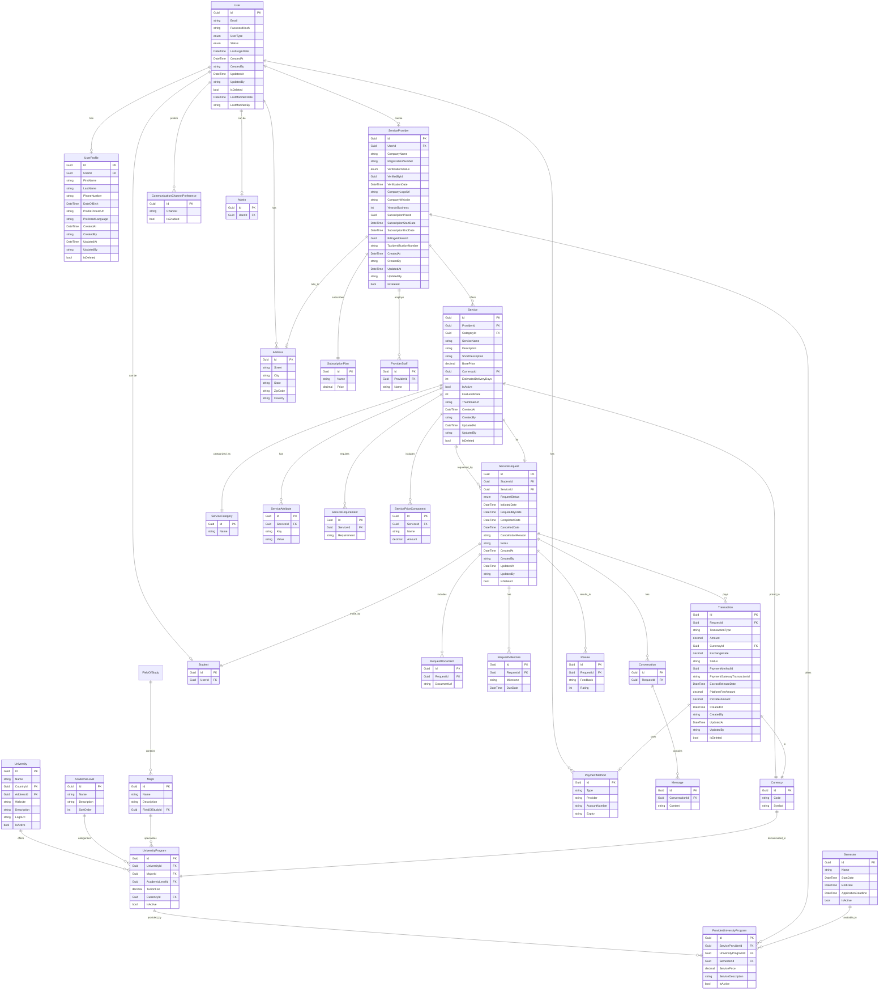

# Software Requirements Specification (SRS): UniConnect Admin Panel

I'll update the SRS document to align with the existing core-api code structure and provide detailed technical specifications.

## 1. Introduction

### 1.1 Purpose

This Software Requirements Specification (SRS) document describes the functional and non-functional requirements for the UniConnect Admin Panel. The admin panel serves as the management interface for platform administrators and service providers within the UniConnect Educational Services Marketplace.

### 1.2 Scope

The UniConnect Admin Panel encompasses two main components:

1. **System Administration Interface**: For platform administrators to manage all aspects of the marketplace
2. **Provider Portal**: For educational service providers to manage their services and customer interactions

The system integrates with the existing UniConnect Core API, which is built using .NET Core and follows a Clean Architecture approach.

## 2. System Architecture

### 2.1 Core API Architecture

The UniConnect Core API follows Clean Architecture principles with the following layers:

1. **Domain Layer**

   - Contains business entities and interfaces
   - Implements domain logic without dependencies on external frameworks

2. **Application Layer**

   - Implements CQRS pattern with Commands and Queries
   - Contains DTOs, validators and mappings
   - Handles business logic orchestration

3. **Infrastructure Layer**

   - Implements repositories, services, and external integrations
   - Manages database access through Entity Framework Core
   - Provides implementations for domain interfaces

4. **API Layer**
   - RESTful API controllers
   - Authentication/Authorization handling
   - Request validation
   - Response formatting

### 2.2 Database Architecture

The system uses PostgreSQL with Entity Framework Core as the ORM. The database is configured with the following key components:

1. **ApplicationDbContext**: Main database context that inherits from IdentityDbContext
2. **EntityConfigurations**: Fluent API configurations for all entities
3. **Migrations**: Entity Framework Core migrations for database versioning

## 3. Data Model

### 3.1 Core Entities

#### 3.1.1 User Entity

```
User {
  Id: Guid (PK)
  Email: string
  PasswordHash: string
  UserType: enum (Student, ServiceProvider, Admin)
  Status: enum (Pending, Active, Suspended, Inactive)
  LastLoginDate: DateTime?
  CreatedAt: DateTime
  CreatedBy: string
  UpdatedAt: DateTime?
  UpdatedBy: string?
  IsDeleted: bool
  LastModifiedDate: DateTime?
  LastModifiedBy: string?

  // Navigation properties
  Profile: UserProfile
  Student: Student
  ServiceProvider: ServiceProvider
  Admin: Admin
  Addresses: List<Address>
  PaymentMethods: List<PaymentMethod>
  CommunicationPreferences: List<CommunicationChannelPreference>
}
```

#### 3.1.2 UserProfile Entity

```
UserProfile {
  Id: Guid (PK)
  UserId: Guid (FK)
  FirstName: string
  LastName: string
  PhoneNumber: string?
  DateOfBirth: DateTime?
  ProfilePictureUrl: string?
  PreferredLanguage: string
  CreatedAt: DateTime
  CreatedBy: string
  UpdatedAt: DateTime?
  UpdatedBy: string?
  IsDeleted: bool

  // Navigation property
  User: User

  // Computed property
  FullName: string
}
```

#### 3.1.3 ServiceProvider Entity

```
ServiceProvider {
  Id: Guid (PK)
  UserId: Guid (FK)
  CompanyName: string
  RegistrationNumber: string?
  VerificationStatus: enum
  VerifiedById: Guid?
  VerificationDate: DateTime?
  CompanyLogoUrl: string?
  CompanyWebsite: string?
  YearsInBusiness: int?
  SubscriptionPlanId: Guid?
  SubscriptionStartDate: DateTime?
  SubscriptionEndDate: DateTime?
  BillingAddressId: Guid?
  TaxIdentificationNumber: string?
  CreatedAt: DateTime
  CreatedBy: string
  UpdatedAt: DateTime?
  UpdatedBy: string?
  IsDeleted: bool

  // Navigation properties
  User: User
  VerifiedBy: User?
  SubscriptionPlan: SubscriptionPlan?
  BillingAddress: Address?
  Staff: List<ProviderStaff>
  Services: List<Service>
}
```

#### 3.1.4 Service Entity

```
Service {
  Id: Guid (PK)
  ProviderId: Guid (FK)
  CategoryId: Guid (FK)
  ServiceName: string
  Description: string?
  ShortDescription: string?
  BasePrice: decimal
  CurrencyId: Guid (FK)
  EstimatedDeliveryDays: int?
  IsActive: bool
  FeaturedRank: int?
  ThumbnailUrl: string?
  CreatedAt: DateTime
  CreatedBy: string
  UpdatedAt: DateTime?
  UpdatedBy: string?
  IsDeleted: bool

  // Navigation properties
  Provider: ServiceProvider
  Category: ServiceCategory
  Currency: Currency
  Attributes: List<ServiceAttribute>
  Requirements: List<ServiceRequirement>
  PriceComponents: List<ServicePriceComponent>
  Requests: List<ServiceRequest>
}
```

#### 3.1.5 ServiceRequest Entity

```
ServiceRequest {
  Id: Guid (PK)
  StudentId: Guid (FK)
  ServiceId: Guid (FK)
  RequestStatus: enum
  InitiatedDate: DateTime
  RequiredByDate: DateTime?
  CompletedDate: DateTime?
  CancelledDate: DateTime?
  CancellationReason: string?
  Notes: string?
  CreatedAt: DateTime
  CreatedBy: string
  UpdatedAt: DateTime?
  UpdatedBy: string?
  IsDeleted: bool

  // Navigation properties
  Student: Student
  Service: Service
  Documents: List<RequestDocument>
  Milestones: List<RequestMilestone>
  Transactions: List<Transaction>
  Conversations: List<Conversation>
  Reviews: List<Review>
}
```

#### 3.1.6 Transaction Entity

```
Transaction {
  Id: Guid (PK)
  RequestId: Guid (FK)
  TransactionType: string
  Amount: decimal
  CurrencyId: Guid (FK)
  ExchangeRate: decimal?
  Status: string
  PaymentMethodId: Guid? (FK)
  PaymentGatewayTransactionId: string?
  EscrowReleaseDate: DateTime?
  PlatformFeeAmount: decimal
  ProviderAmount: decimal
  CreatedAt: DateTime
  CreatedBy: string
  UpdatedAt: DateTime?
  UpdatedBy: string?
  IsDeleted: bool

  // Navigation properties
  Request: ServiceRequest
  Currency: Currency
  PaymentMethod: PaymentMethod?
}
```

#### 3.1.7 University Entity

```
University {
  Id: Guid (PK)
  Name: string
  CountryId: Guid (FK)
  AddressId: Guid (FK)
  Website: string
  Description: string
  LogoUrl: string
  IsActive: bool
  CreatedAt: DateTime
  CreatedBy: string
  UpdatedAt: DateTime?
  UpdatedBy: string?
  IsDeleted: bool

  // Navigation properties
  Country: Country
  Address: Address
  Programs: List<UniversityProgram>
}
```

#### 3.1.8 AcademicLevel Entity

```
AcademicLevel {
  Id: Guid (PK)
  Name: string
  Description: string
  SortOrder: int
  CreatedAt: DateTime
  CreatedBy: string
  UpdatedAt: DateTime?
  UpdatedBy: string?
  IsDeleted: bool

  // Navigation properties
  Programs: List<UniversityProgram>
}
```

#### 3.1.9 Major Entity

```
Major {
  Id: Guid (PK)
  Name: string
  Description: string
  FieldOfStudyId: Guid (FK)
  CreatedAt: DateTime
  CreatedBy: string
  UpdatedAt: DateTime?
  UpdatedBy: string?
  IsDeleted: bool

  // Navigation properties
  FieldOfStudy: FieldOfStudy
  Programs: List<UniversityProgram>
}
```

#### 3.1.10 UniversityProgram Entity

```
UniversityProgram {
  Id: Guid (PK)
  UniversityId: Guid (FK)
  MajorId: Guid (FK)
  AcademicLevelId: Guid (FK)
  TuitionFee: decimal
  CurrencyId: Guid (FK)
  IsActive: bool
  CreatedAt: DateTime
  CreatedBy: string
  UpdatedAt: DateTime?
  UpdatedBy: string?
  IsDeleted: bool

  // Navigation properties
  University: University
  Major: Major
  AcademicLevel: AcademicLevel
  Currency: Currency
  ProviderPrograms: List<ProviderUniversityProgram>
}
```

#### 3.1.11 Semester Entity

```
Semester {
  Id: Guid (PK)
  Name: string
  StartDate: DateTime
  EndDate: DateTime
  ApplicationDeadline: DateTime?
  IsActive: bool
  CreatedAt: DateTime
  CreatedBy: string
  UpdatedAt: DateTime?
  UpdatedBy: string?
  IsDeleted: bool

  // Navigation properties
  ProviderPrograms: List<ProviderUniversityProgram>
}
```

#### 3.1.12 ProviderUniversityProgram Entity

```
ProviderUniversityProgram {
  Id: Guid (PK)
  ServiceProviderId: Guid (FK)
  UniversityProgramId: Guid (FK)
  SemesterId: Guid (FK)
  ServicePrice: decimal
  ServiceDescription: string
  IsActive: bool
  CreatedAt: DateTime
  CreatedBy: string
  UpdatedAt: DateTime?
  UpdatedBy: string?
  IsDeleted: bool

  // Navigation properties
  ServiceProvider: ServiceProvider
  UniversityProgram: UniversityProgram
  Semester: Semester
  Currency: Currency
}
```

### 3.2 Complete Entity Relationships



#### Key Relationships:

1. User (1) → UserProfile (1)
2. User (1) → Student (0..1)
3. User (1) → ServiceProvider (0..1)
4. User (1) → Admin (0..1)
5. User (1) → Addresses (0..\*)
6. ServiceProvider (1) → Services (0..\*)
7. Service (1) → ServiceRequests (0..\*)
8. ServiceRequest (1) → Transactions (0..\*)
9. ServiceRequest (1) → RequestDocuments (0..\*)
10. ServiceRequest (1) → Conversations (0..\*)
11. Conversation (1) → Messages (0..\*)
12. University (1) → UniversityPrograms (0..\*)
13. AcademicLevel (1) → UniversityPrograms (0..\*)
14. Major (1) → UniversityPrograms (0..\*)
15. UniversityProgram (1) → ProviderUniversityPrograms (0..\*)
16. ServiceProvider (1) → ProviderUniversityPrograms (0..\*)
17. Semester (1) → ProviderUniversityPrograms (0..\*)
18. FieldOfStudy (1) → Majors (0..\*)

## 4. API Endpoints

### 4.1 Authentication Endpoints

The UniConnect Core API implements authentication endpoints that integrate with Keycloak for identity and access management. These endpoints handle user authentication, token validation, and user session management.

#### 4.1.1 Authenticate User

- **Endpoint**: POST /api/v1/auth/login
- **Method**: POST
- **Content-Type**: application/json
- **Description**: Authenticates user with Keycloak and returns application tokens
- **Request Body**:
  ```json
  {
    "email": "john.doe@example.com",
    "password": "userPassword123",
    "clientId": "uniconnect-admin-panel",
    "rememberMe": true
  }
  ```
- **Response**:
  ```json
  {
    "success": true,
    "data": {
      "accessToken": "eyJhbGciOiJSUzI1NiIsInR5cCI6IkpXVCJ9...",
      "refreshToken": "eyJhbGciOiJIUzI1NiIsInR5cCI6IkpXVCJ9...",
      "expiresIn": 3600,
      "tokenType": "Bearer",
      "user": {
        "id": "user-uuid",
        "email": "john.doe@example.com",
        "firstName": "John",
        "lastName": "Doe",
        "userType": "Student",
        "roles": ["student", "user"],
        "isEmailVerified": true
      }
    }
  }
  ```
- **Status Codes**: 200 OK, 400 Bad Request, 401 Unauthorized, 422 Unprocessable Entity

#### 4.1.2 OAuth Callback Handler

- **Endpoint**: POST /api/v1/auth/oauth/callback
- **Method**: POST
- **Content-Type**: application/json
- **Description**: Handles OAuth callback from Keycloak and processes authorization code
- **Request Body**:
  ```json
  {
    "code": "authorization_code_from_keycloak",
    "state": "csrf_protection_state",
    "clientId": "uniconnect-admin-panel",
    "redirectUri": "https://admin.uniconnect.com/callback"
  }
  ```
- **Response**: Same as Authenticate User response
- **Status Codes**: 200 OK, 400 Bad Request, 401 Unauthorized

#### 4.1.3 Refresh Access Token

- **Endpoint**: POST /api/v1/auth/refresh
- **Method**: POST
- **Content-Type**: application/json
- **Authorization**: Bearer refresh_token (or in request body)
- **Description**: Refreshes access token using refresh token
- **Request Body**:
  ```json
  {
    "refreshToken": "refresh_token_value",
    "clientId": "uniconnect-admin-panel"
  }
  ```
- **Response**:
  ```json
  {
    "success": true,
    "data": {
      "accessToken": "new_access_token",
      "refreshToken": "new_refresh_token",
      "expiresIn": 3600,
      "tokenType": "Bearer"
    }
  }
  ```
- **Status Codes**: 200 OK, 400 Bad Request, 401 Unauthorized

#### 4.1.4 Validate Token

- **Endpoint**: POST /api/v1/auth/validate
- **Method**: POST
- **Content-Type**: application/json
- **Authorization**: Bearer access_token
- **Description**: Validates access token with Keycloak and returns user info
- **Request Body**:
  ```json
  {
    "token": "access_token_to_validate"
  }
  ```
- **Response**:
  ```json
  {
    "success": true,
    "data": {
      "isValid": true,
      "user": {
        "id": "user-uuid",
        "email": "john.doe@example.com",
        "firstName": "John",
        "lastName": "Doe",
        "userType": "Student",
        "roles": ["student", "user"],
        "permissions": ["read:profile", "write:profile"]
      },
      "expiresAt": "2024-01-01T12:00:00Z"
    }
  }
  ```
- **Status Codes**: 200 OK, 401 Unauthorized

#### 4.1.5 Get Current User

- **Endpoint**: GET /api/v1/auth/me
- **Method**: GET
- **Authorization**: Bearer access_token required
- **Description**: Returns current authenticated user information
- **Response**:
  ```json
  {
    "success": true,
    "data": {
      "id": "user-uuid",
      "email": "john.doe@example.com",
      "firstName": "John",
      "lastName": "Doe",
      "userType": "Student",
      "status": "Active",
      "roles": ["student", "user"],
      "permissions": ["read:profile", "write:profile"],
      "lastLoginDate": "2024-01-01T10:00:00Z",
      "profilePictureUrl": "https://storage.uniconnect.com/avatars/user-uuid.jpg"
    }
  }
  ```
- **Status Codes**: 200 OK, 401 Unauthorized

#### 4.1.6 Logout User

- **Endpoint**: POST /api/v1/auth/logout
- **Method**: POST
- **Authorization**: Bearer access_token required
- **Content-Type**: application/json
- **Description**: Logs out user from Keycloak and invalidates tokens
- **Request Body**:
  ```json
  {
    "refreshToken": "refresh_token_value",
    "logoutFromKeycloak": true
  }
  ```
- **Response**:
  ```json
  {
    "success": true,
    "message": "User logged out successfully"
  }
  ```
- **Status Codes**: 200 OK, 401 Unauthorized

#### 4.1.7 Register User

- **Endpoint**: POST /api/v1/auth/register
- **Method**: POST
- **Content-Type**: application/json
- **Description**: Registers new user in Keycloak and local database
- **Request Body**:
  ```json
  {
    "email": "john.doe@example.com",
    "password": "userPassword123",
    "confirmPassword": "userPassword123",
    "firstName": "John",
    "lastName": "Doe",
    "userType": "Student",
    "phoneNumber": "+1234567890",
    "preferredLanguage": "en",
    "agreeToTerms": true
  }
  ```
- **Response**:
  ```json
  {
    "success": true,
    "data": {
      "userId": "user-uuid",
      "email": "john.doe@example.com",
      "emailVerificationRequired": true,
      "message": "Registration successful. Please check your email for verification."
    }
  }
  ```
- **Status Codes**: 201 Created, 400 Bad Request, 409 Conflict

#### 4.1.8 Verify Email

- **Endpoint**: POST /api/v1/auth/verify-email
- **Method**: POST
- **Content-Type**: application/json
- **Description**: Verifies user email using verification token
- **Request Body**:
  ```json
  {
    "token": "email_verification_token",
    "email": "john.doe@example.com"
  }
  ```
- **Response**:
  ```json
  {
    "success": true,
    "message": "Email verified successfully"
  }
  ```
- **Status Codes**: 200 OK, 400 Bad Request, 404 Not Found

#### 4.1.9 Forgot Password

- **Endpoint**: POST /api/v1/auth/forgot-password
- **Method**: POST
- **Content-Type**: application/json
- **Description**: Initiates password reset process via Keycloak
- **Request Body**:
  ```json
  {
    "email": "john.doe@example.com",
    "clientId": "uniconnect-admin-panel"
  }
  ```
- **Response**:
  ```json
  {
    "success": true,
    "message": "Password reset email sent successfully"
  }
  ```
- **Status Codes**: 200 OK, 404 Not Found

#### 4.1.10 Reset Password

- **Endpoint**: POST /api/v1/auth/reset-password
- **Method**: POST
- **Content-Type**: application/json
- **Description**: Resets user password using reset token
- **Request Body**:
  ```json
  {
    "token": "password_reset_token",
    "newPassword": "newPassword123",
    "confirmPassword": "newPassword123"
  }
  ```
- **Response**:
  ```json
  {
    "success": true,
    "message": "Password reset successfully"
  }
  ```
- **Status Codes**: 200 OK, 400 Bad Request, 404 Not Found

#### 4.1.11 Change Password

- **Endpoint**: POST /api/v1/auth/change-password
- **Method**: POST
- **Authorization**: Bearer access_token required
- **Content-Type**: application/json
- **Description**: Changes user password (requires current password)
- **Request Body**:
  ```json
  {
    "currentPassword": "currentPassword123",
    "newPassword": "newPassword123",
    "confirmPassword": "newPassword123"
  }
  ```
- **Response**:
  ```json
  {
    "success": true,
    "message": "Password changed successfully"
  }
  ```
- **Status Codes**: 200 OK, 400 Bad Request, 401 Unauthorized

#### 4.1.12 Revoke Token

- **Endpoint**: POST /api/v1/auth/revoke
- **Method**: POST
- **Authorization**: Bearer access_token required
- **Content-Type**: application/json
- **Description**: Revokes refresh token in Keycloak
- **Request Body**:
  ```json
  {
    "refreshToken": "refresh_token_to_revoke"
  }
  ```
- **Response**:
  ```json
  {
    "success": true,
    "message": "Token revoked successfully"
  }
  ```
- **Status Codes**: 200 OK, 400 Bad Request, 401 Unauthorized

#### 4.1.13 Get User Sessions

- **Endpoint**: GET /api/v1/auth/sessions
- **Method**: GET
- **Authorization**: Bearer access_token required
- **Description**: Returns active user sessions from Keycloak
- **Response**:
  ```json
  {
    "success": true,
    "data": [
      {
        "sessionId": "session-uuid",
        "clientId": "uniconnect-admin-panel",
        "ipAddress": "192.168.1.1",
        "userAgent": "Mozilla/5.0...",
        "lastAccess": "2024-01-01T11:00:00Z",
        "started": "2024-01-01T10:00:00Z",
        "isCurrent": true
      }
    ]
  }
  ```
- **Status Codes**: 200 OK, 401 Unauthorized

#### 4.1.14 Terminate Session

- **Endpoint**: DELETE /api/v1/auth/sessions/{sessionId}
- **Method**: DELETE
- **Authorization**: Bearer access_token required
- **Description**: Terminates specific user session in Keycloak
- **Response**:
  ```json
  {
    "success": true,
    "message": "Session terminated successfully"
  }
  ```
- **Status Codes**: 200 OK, 401 Unauthorized, 404 Not Found

#### 4.1.15 Enable Two-Factor Authentication

- **Endpoint**: POST /api/v1/auth/2fa/enable
- **Method**: POST
- **Authorization**: Bearer access_token required
- **Content-Type**: application/json
- **Description**: Enables 2FA for user account
- **Request Body**:
  ```json
  {
    "password": "currentPassword123"
  }
  ```
- **Response**:
  ```json
  {
    "success": true,
    "data": {
      "qrCodeUrl": "data:image/png;base64,iVBORw0KGgoAAAANSUhEUgAA...",
      "secretKey": "JBSWY3DPEHPK3PXP",
      "backupCodes": ["12345678", "87654321", "11111111"]
    }
  }
  ```
- **Status Codes**: 200 OK, 400 Bad Request, 401 Unauthorized

#### 4.1.16 Verify Two-Factor Authentication Setup

- **Endpoint**: POST /api/v1/auth/2fa/verify-setup
- **Method**: POST
- **Authorization**: Bearer access_token required
- **Content-Type**: application/json
- **Description**: Verifies 2FA setup with TOTP code
- **Request Body**:
  ```json
  {
    "totpCode": "123456"
  }
  ```
- **Response**:
  ```json
  {
    "success": true,
    "message": "Two-factor authentication enabled successfully"
  }
  ```
- **Status Codes**: 200 OK, 400 Bad Request, 401 Unauthorized

#### 4.1.17 Disable Two-Factor Authentication

- **Endpoint**: POST /api/v1/auth/2fa/disable
- **Method**: POST
- **Authorization**: Bearer access_token required
- **Content-Type**: application/json
- **Description**: Disables 2FA for user account
- **Request Body**:
  ```json
  {
    "password": "currentPassword123",
    "totpCode": "123456"
  }
  ```
- **Response**:
  ```json
  {
    "success": true,
    "message": "Two-factor authentication disabled successfully"
  }
  ```
- **Status Codes**: 200 OK, 400 Bad Request, 401 Unauthorized

#### 4.1.18 Social Login Initiation

- **Endpoint**: GET /api/v1/auth/social/{provider}
- **Method**: GET
- **Description**: Initiates social login flow (Google, Facebook, etc.)
- **Path Parameters**:
  - provider: string (google, facebook, github, linkedin)
- **Query Parameters**:
  - redirect_uri: string (optional)
  - state: string (optional)
- **Response**: 302 Redirect to social provider
- **Status Codes**: 302 Found, 400 Bad Request

#### 4.1.19 Social Login Callback

- **Endpoint**: POST /api/v1/auth/social/{provider}/callback
- **Method**: POST
- **Content-Type**: application/json
- **Description**: Handles social login callback
- **Path Parameters**:
  - provider: string (google, facebook, github, linkedin)
- **Request Body**:
  ```json
  {
    "code": "authorization_code_from_provider",
    "state": "csrf_protection_state"
  }
  ```
- **Response**: Same as Authenticate User response
- **Status Codes**: 200 OK, 400 Bad Request, 401 Unauthorized

#### 4.1.20 Link Social Account

- **Endpoint**: POST /api/v1/auth/social/{provider}/link
- **Method**: POST
- **Authorization**: Bearer access_token required
- **Content-Type**: application/json
- **Description**: Links social account to existing user account
- **Path Parameters**:
  - provider: string (google, facebook, github, linkedin)
- **Request Body**:
  ```json
  {
    "code": "authorization_code_from_provider",
    "state": "csrf_protection_state"
  }
  ```
- **Response**:
  ```json
  {
    "success": true,
    "message": "Social account linked successfully"
  }
  ```
- **Status Codes**: 200 OK, 400 Bad Request, 401 Unauthorized, 409 Conflict

#### 4.1.21 Unlink Social Account

- **Endpoint**: DELETE /api/v1/auth/social/{provider}
- **Method**: DELETE
- **Authorization**: Bearer access_token required
- **Description**: Unlinks social account from user account
- **Path Parameters**:
  - provider: string (google, facebook, github, linkedin)
- **Response**:
  ```json
  {
    "success": true,
    "message": "Social account unlinked successfully"
  }
  ```
- **Status Codes**: 200 OK, 401 Unauthorized, 404 Not Found

### 4.1.22 Keycloak Integration Configuration

#### Backend Service Configuration

- **Keycloak Server URL**: https://keycloak.uniconnect.com/auth
- **Realm**: uniconnect
- **Client ID**: uniconnect-core-api
- **Client Secret**: Configured via environment variables
- **Grant Types**: authorization_code, refresh_token, client_credentials

#### API Client Roles Mapping

- **admin**: Maps to Keycloak admin role
- **service-provider**: Maps to Keycloak service-provider role
- **provider-staff**: Maps to Keycloak provider-staff role
- **student**: Maps to Keycloak student role
- **moderator**: Maps to Keycloak moderator role

#### Token Validation

- **JWT Signature Verification**: Using Keycloak's public keys (JWKS)
- **Token Introspection**: For detailed token validation
- **Role and Permission Mapping**: From Keycloak claims to application permissions

#### Error Handling

All authentication endpoints follow consistent error response format:

```json
{
  "success": false,
  "error": {
    "code": "AUTHENTICATION_FAILED",
    "message": "Invalid credentials provided",
    "details": {
      "field": "password",
      "reason": "Password does not meet requirements"
    }
  },
  "timestamp": "2024-01-01T12:00:00Z",
  "traceId": "trace-uuid"
}
```

#### Rate Limiting

- **Login attempts**: 5 attempts per 15 minutes per IP
- **Password reset**: 3 requests per hour per email
- **Token refresh**: 10 requests per minute per user
- **Registration**: 3 registrations per hour per IP

## 6. Integration Services

### 6.1 Email Service

- Transactional emails for notifications
- Email templates support
- Email delivery tracking

### 6.2 SMS Service

- SMS notifications for critical alerts
- SMS verification codes

### 6.3 Storage Service

- Minio integration for document and media storage
- Secure file upload/download
- Access control for stored files

### 6.4 Payment Service

- Integration with payment gateways
- Secure payment processing
- Transaction recording

### 6.5 Cache Service

- Redis integration for caching
- Distributed cache for scalability
- Cache invalidation strategies

## 7. Non-Functional Requirements

### 7.1 Performance Requirements

1. **Response Time**:

   - API endpoints should respond within 500ms for standard operations
   - Batch operations may take up to 5 seconds
   - Monitoring via PerformanceBehaviour pipeline

2. **Throughput**:

   - Support for at least 100 requests per second
   - Graceful degradation under heavy load

3. **Scalability**:
   - Horizontal scaling through containerization
   - Stateless design for the API layer

### 7.2 Security Requirements

1. **Authentication**:

   - Multi-factor authentication for administrative access
   - JWT with refresh token rotation
   - Password complexity requirements

2. **Authorization**:

   - Fine-grained RBAC
   - Resource-based access control

3. **Data Protection**:
   - Encryption at rest for sensitive data
   - Secure deletion policies

### 7.3 Reliability Requirements

1. **Availability**:

   - 99.9% uptime target
   - Automated health checks

2. **Fault Tolerance**:

   - Graceful error handling
   - Retry policies for external services
   - Circuit breakers for degraded services

3. **Data Integrity**:
   - Transactional database operations
   - Audit trails for all changes

### 7.4 Compatibility Requirements

1. **API Versioning**:

   - Support for multiple API versions
   - Backwards compatibility guarantees

2. **Client Compatibility**:
   - API compatible with modern web browsers
   - Mobile client support

## Appendix A: Database Schema

### Identity Tables

- AspNetUsers
- AspNetRoles
- AspNetUserRoles
- AspNetUserClaims
- AspNetRoleClaims
- AspNetUserLogins
- AspNetUserTokens

### Core Domain Tables

- Users
- UserProfiles
- Students
- ServiceProviders
- ProviderStaff
- Admins
- Addresses
- Countries
- Universities
- FieldsOfStudy
- ServiceCategories
- Services
- ServiceAttributes
- ServiceRequirements
- ServicePriceComponents
- ServiceRequests
- RequestDocuments
- DocumentTypes
- RequestMilestones
- Currencies
- Transactions
- PaymentMethods
- SubscriptionPlans
- Invoices
- InvoiceItems
- Messages
- Conversations
- ConversationParticipants
- Notifications
- CommunicationChannelPreferences
- SystemLogs
- ErrorCodes
- ApiKeys
- FeatureToggles
- Reviews
- ReviewResponses
- RefreshTokens

## Appendix B: Implementation Classes

### Domain Layer

- Base Entity Classes (BaseEntity, AuditableEntity)
- Domain Entities (User, Service, Transaction, etc.)
- Domain Interfaces (IRepository, IDateTime, etc.)

### Application Layer

- CQRS Commands and Queries
- DTOs and Mapping Profiles
- Validators
- Behaviors (Validation, Performance, Exception Handling)
- Interfaces (IApplicationDbContext, ICacheService, etc.)

### Infrastructure Layer

- Database Context (ApplicationDbContext)
- Entity Configurations
- Repositories (Repository<T>, UnitOfWork)
- Services (EmailService, SmsService, etc.)
- Identity (ApplicationUser, IdentityService)

### API Layer

- Controllers (AuthController, UsersController, etc.)
- Middleware
- Filters
- Exception Handling
